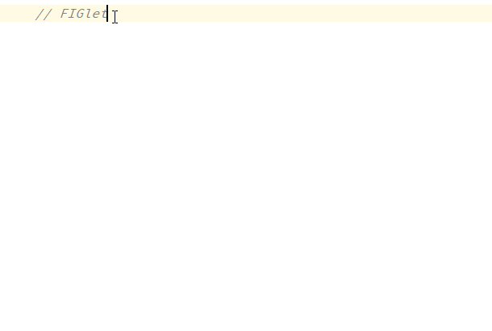

```
  _____.__  ________.__          __   
_/ ____\__|/  _____/|  |   _____/  |_ 
\   __\|  /   \  ___|  | _/ __ \   __\
 |  |  |  \    \_\  \  |_\  ___/|  |  
 |__|  |__|\______  /____/\___  >__|  
                  \/          \/      
```
[](https://github.com/YiiGuxing/intellij-figlet/blob/master/LICENSE)
[](https://github.com/YiiGuxing/intellij-figlet/releases/latest)
-----

A [FIGlet](http://www.figlet.org)-based ASCII Art generation plugin for IntelliJ based IDEs.


Installation
------------

- Using IDE built-in plugin system:
  - <kbd>Settings(Preferences)</kbd> > <kbd>Plugins</kbd> > <kbd>Marketplace/Browse repositories...</kbd> > <kbd>Search for "figlet"</kbd> > <kbd>Install Plugin</kbd>
- Manually:
  - Download the [latest release](https://github.com/YiiGuxing/intellij-figlet/releases/latest) and install it manually using <kbd>Settings(Preferences)</kbd> > <kbd>Plugins</kbd> > <kbd>Install plugin from disk...</kbd>
  
Restart IDE.

Usage
-----

1. Select the text you want to convert on the editor (Optional).
2. <kbd>Alt + Insert</kbd> > <kbd>ASCII Art</kbd>, or <kbd>Main menu</kbd> > <kbd>Code</kbd> > <kbd>Generate...</kbd> > <kbd>ASCII Art</kbd>.
3. Click the <kbd>Generate ASCII Art Text</kbd> button.

